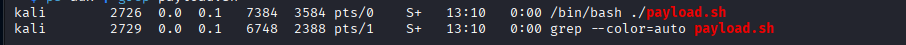
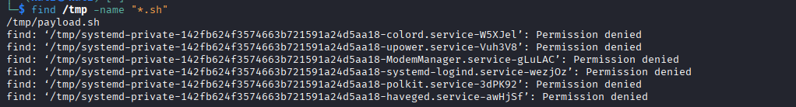
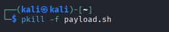
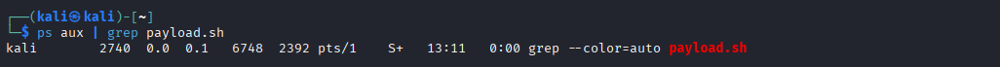
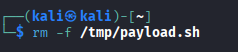
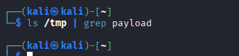

# Incident Response Basics – Suspicious Bash Script Execution on Linux

## 🎯 Objective

This project demonstrates the basic incident response lifecycle by simulating and responding to a suspicious Bash script execution on a Linux system. The goal is to understand how attackers abuse temporary directories and how defenders detect, contain, eradicate, and document such incidents.

## ⚠️ Simulation Disclaimer

This project involves the creation of a **simulated suspicious Bash script** for educational purposes only.  
The script does not perform any malicious activity and is used solely to demonstrate the incident response process in a controlled lab environment.


## 📘 What is Incident Response?

Incident Response (IR) is a structured approach used to detect, investigate, contain, and recover from security incidents. This lab follows the NIST Incident Response framework to handle a suspicious script execution scenario.

## 🔁 Incident Response Framework

This project follows the NIST SP 800-61 Incident Response lifecycle:

1. Preparation  
2. Detection and Analysis  
3. Containment, Eradication, and Recovery  
4. Post-Incident Activity


## ⚠️ Scenario

A suspicious Bash script disguised as a backup utility was found executing from the `/tmp` directory. Since `/tmp` is a world-writable and commonly abused directory, this activity was flagged for investigation.

## 🛠️ Lab Environment

- Operating System: Linux (Ubuntu / Kali)
- User Privileges: Standard user with sudo access
- Tools Used: ps, grep, find, chmod, rm

### Simulated Script Creation

The following screenshot shows the creation of a simulated suspicious Bash script using the `nano` text editor. This script mimics common attacker behavior while remaining safe for educational use.
path for payload.png is path for payload.sh is /tmp/payload.sh


 
## 🟦 Phase 1: Preparation

Before interacting with the suspicious activity, the environment was prepared by ensuring access to basic Linux process and file analysis tools. No immediate remediation actions were taken to avoid loss of evidence. Evidence preservation was prioritized by avoiding immediate deletion or modification of files until analysis was complete.

## 🟨 Phase 2: Detection and Analysis

Suspicious activity was detected in the form of a Bash script executing from the `/tmp` directory. Since `/tmp` is a world-writable location commonly abused by attackers, this behavior warranted further investigation.

### Step 2.1: Process Identification

Running processes were examined to identify suspicious activity.

```bash
ps aux | grep payload.sh
```


## Step 2.2: Suspicious Process Confirmation

Running processes were analyzed to identify the suspicious script.



### Step 2.3: File Location Analysis

The `/tmp` directory was scanned to locate suspicious shell scripts.




### Step 2.4: Analysis Findings

- Script executed from `/tmp`
- Filename appeared legitimate
- Background execution observed
- Behavior consistent with attacker techniques

## 🟥 Phase 3: Containment, Eradication, and Recovery

### Step 3.1: Containment

The suspicious process was terminated to prevent further execution.

```bash
pkill -f payload.sh
```


#### To Verify

``` bash
ps aux | grep payload.sh
```


### Step 3.2: Eradication

The malicious script was removed from the system.

```bash
rm -f /tmp/payload.sh
```


#### To verify

```bash
ls /tmp | grep payload
```


### Step 3.3: Persistence Check (Crontab Review)

As part of the eradication phase, persistence mechanisms were reviewed to ensure the script was not configured to re-execute automatically. Attackers commonly use scheduled tasks such as cron jobs to maintain persistence.

``` bash 
crontab -l
```

### Step 3.4: Recovery

The system was verified to ensure no suspicious files or processes remained. Normal system operation was restored.

## 🟩 Phase 4: Post-Incident Activity

### Incident Summary

- Suspicious Bash script executed from `/tmp`
- Script disguised as a backup utility
- Identified using process analysis
- Successfully contained and eradicated

### Lessons Learned
- Temporary directories like `/tmp` are commonly abused by attackers
- Legitimate-looking filenames can be deceptive
- Process monitoring is critical for early detection

### ATT&CK Technique Mapping

- **T1059.004 – Command and Scripting Interpreter: Bash**  
  The suspicious script was executed using the Bash shell, which is a common technique used by attackers on Linux systems to execute malicious payloads without dropping additional tools.

- **T1036 – Masquerading**  
  The script was disguised as a legitimate backup utility, a common evasion technique where attackers use benign-looking filenames to avoid detection.


This project demonstrates foundational incident response skills aligned with SOC analyst responsibilities, including detection, containment, eradication, and post-incident documentation.


